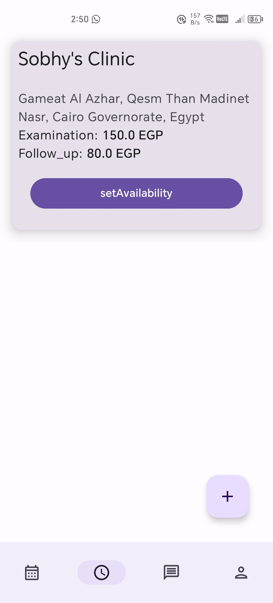
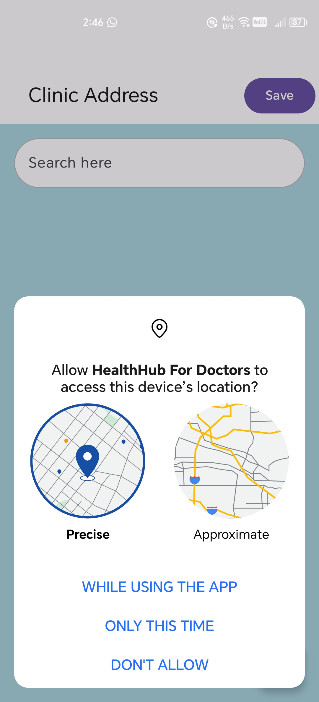
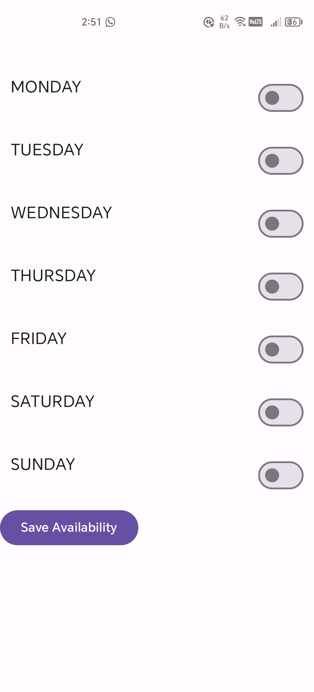

# HealthHub For Doctors Application

## Overview
Welcome to HealthHub For Doctor Doctor is a clinic management Android application developed using Kotlin and Jetpack Compose. This application is designed to streamline the operations of doctor clinics by managing patient registrations, appointments, and doctor availability.

 

## Features

- **Doctor Registration**: Easy registration and management of doctor information.
- **Doctor Availability Management**: Doctors can update their availability and manage their schedules.
- **User-Friendly Interface**: Intuitive design using Jetpack Compose for a seamless user experience.
- **Secure Data Handling**: Ensures all patient and appointment data is stored securely using Room database.

## Screenshots

## Features
- **Authentication:** The authentication feature has a login, register, and forget password.
  

  
  
  
  
  
  
  
  

- **Profile:** Display the user profile and manage it.
  

    
    
    
    
    
  

  
- **Clinics:** Display Clinics and their information.
  

    
    
    
  

  
- **add clinic:** add clinic form.
  

    
    
    
    
    
    
    
  

  
 

## Getting Started

To run HealthHub application locally:
1. Clone this repository: `https://github.com/Sobhy-Abdelhakam/HealthHub-for-doctors.git`
2. Open the project in Android Studio.
3. Build and run the application on an emulator or a physical device.

 

## Dependencies

HealthHub for doctors relies on the following key dependencies:

* [Jetpack Compose](https://www.jetpackcompose.net)
* [Compose Navigation](https://developer.android.com/develop/ui/compose/navigation)
* [Retrofit](https://github.com/square/retrofit)
* [Room DataBase](https://developer.android.com/training/data-storage/room)
* [Coroutines](https://developer.android.com/kotlin/coroutines)
* [Model-view-intent(MVI)](https://medium.com/swlh/mvi-architecture-with-android-fcde123e3c4a)
* [Model-View-ViewModel(MVVM)](https://developer.android.com/topic/libraries/architecture/viewmodel)
* [Flows](https://developer.android.com/kotlin/flow)
* [UI State](https://developer.android.com/topic/architecture/ui-layer/stateholders)
* [Dependency injection with Hilt](https://developer.android.com/training/dependency-injection/hilt-android)
* [DataStore Preferences](https://developer.android.com/codelabs/android-preferences-datastore)
* [Clean Architecture](https://www.raywenderlich.com/3595916-clean-architecture-tutorial-for-android-getting-started)

For a complete list of dependencies, please refer to the `build.gradle` files.

 

